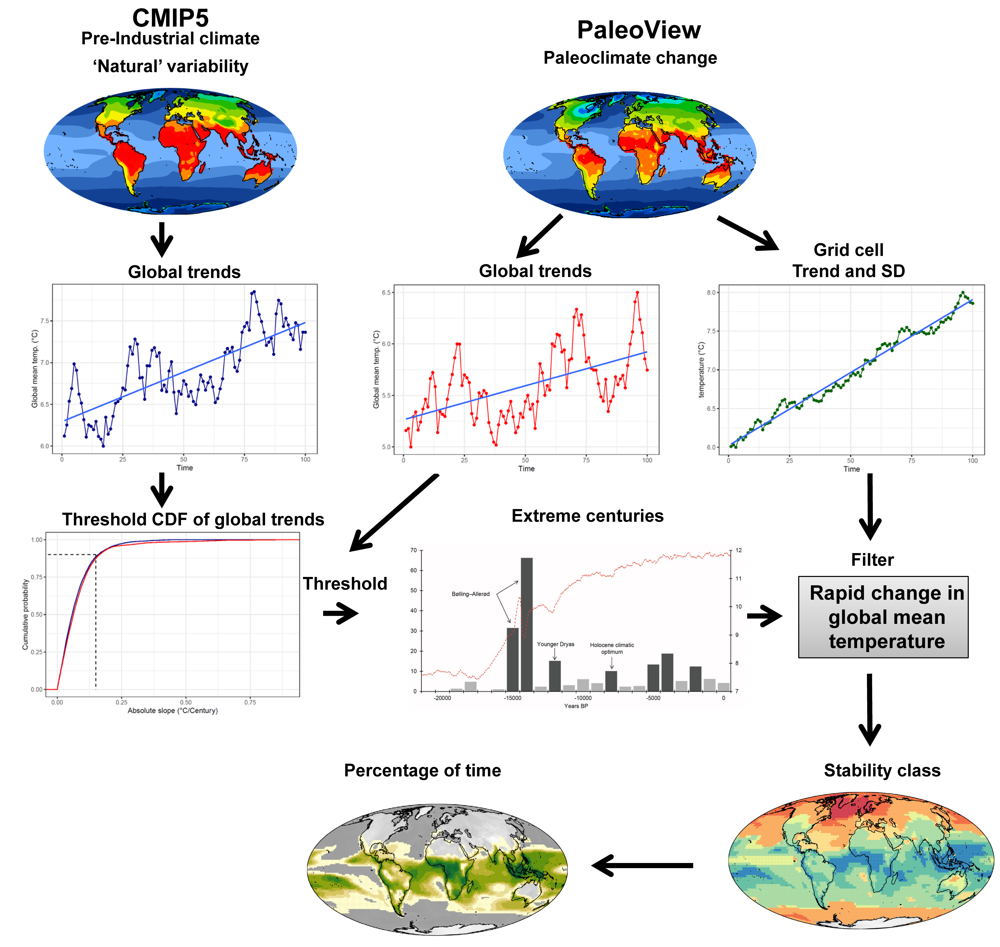

Climate stability supporting figures
================

   **Fordham, D., Brown, S., Wigley, T., Rahbek, C., 2019. Cradles of diversity: unlikely relics of regional climate stability. *Current Biology* (https://doi.org/10.1016/j.cub.2019.04.001)**   

### Supporting Figures

Figure 1: Cumulative Distribution Functions (CDFs) of trends in global-mean temperature for the pre-industrial CMIP5 control runs. Different colours represent the bootstrap replicates for each of the different models; the black line represents the mean of all the CDFs for each model bootstrap. Trends were calculated using a 100-year moving window with a 1-year step between windows.

  

Figure 2: Figure 2: Workflow for estimating percentage of time spent in stable and extremely stable climates. CMIP5 pre-industrial control runs were used to estimate century trends in annual global mean temperature under conditions of natural variability focused on 100BP (1850 AD). The 90th percentile was used to calculate a threshold for identifying the most extreme century trends in global mean temperature for pre-industrial control runs. Century trends in annual global mean temperature and century trends and SD in annual grid cell mean temperature were generated for the last 21,000 using data from PaleoView. The threshold (90th percentile) for extreme century trends in global mean temperature for pre-industrial control runs was applied to the PaleoView estimates to identify centuries of rapid change (extreme centuries) in the past. These centuries were used to filter the time series of paleoclimate simulations of grid cell trends and SD, such that for each century of rapid change in global mean temperature, classes of climate stability were derived and the percentage of time a grid cell spent in a given stability class was calculated for all extreme centuries

  

Figure 3: Percentage of time spent in 'extreme' conditions of global climate change defined as having century timescale trend magnitudes ≥ 90th percentile of the bootstrapped pre-industrial control-run trend magnitudes in global-mean temperature. The primary Y-axis and the vertical bars show the amount of time in a given millennium (X-axis) when the trend in global mean temperature is ≥ the cut-off threshold. Darker bars show millennia where centuries of unusually high trends in global mean temperatures occurred in > 10% of the millennia. The secondary (right hand) Y-axis and the dashed red line shows the global-mean temperature from the TraCE-21ka dataset (°C). The blue line shows the slope for the linear trend for the global-mean temperature from the TraCE-21ka dataset (°C per year). Major climatic events are shown with arrows.

